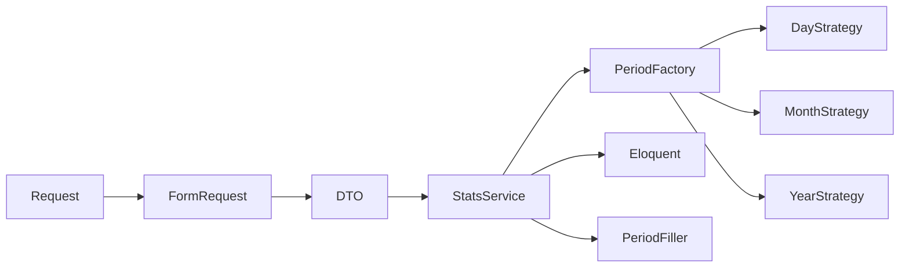

# План: API статистики платежей

Реализация по задаче [`ai-tasks/statistics.md`](../ai-tasks/statistics.md).

## Контекст

- Платежи: [`Payment`](../application/app/Models/Payment.php) — `amount` (тийины), `status` (`STATUS_PAID = 1`), связь `cashbox` → `user`. Поля `paid_at` нет.
- Учёт: только успешные платежи, группировка по `created_at`.
- Доход платформы: 10% суммы → `intdiv($sumAmount, 10)` (без float).
- БД в Docker: PostgreSQL (`date_trunc`).
- Слои: контроллер → FormRequest → DTO → Service; Strategy по аналогии с [`UserFilters`](../application/app/Services/Assistants/UserFilters/).
- TDD через Docker: `docker compose exec -u www-data php php artisan test`.

## Зафиксированные решения

- Мерчант: статистика по одной кассе (владелец).
- Админ: один endpoint с `group_by=cashbox|user`.
- Query обязательны: `period`, `from`, `to` (`Y-m-d`).
- Пустые периоды: ось периодов в PHP, merge с результатом агрегации.
- Админ-доступ: permission `statistics.view` + `can:` (строже, чем текущий `/admin/payments`).
- Запросы к БД: предпочтительно **Laravel Query Builder** / Eloquent builder (`selectRaw` / `groupBy` / `where` и т.д.), а не чистые SQL-строки целиком. Выражение bucket из Strategy допускается через `selectRaw`/`groupByRaw` как фрагмент, но сборка запроса — через builder.

## API

### Мерчант

`GET /api/cashboxes/{cashbox}/statistics`

- Middleware: `auth:sanctum`, banned-check, `can:viewStatistics,cashbox`
- Query: `period=day|month|year`, `from`, `to`

Ответ:

```json
{
  "data": [
    {"period": "2026-09-01", "payments_count": 5, "average_check": 150000},
    {"period": "2026-09-02", "payments_count": 0, "average_check": 0}
  ]
}
```

- Формат `period`: день `Y-m-d`, месяц `Y-m-01`, год `Y-01-01`
- `average_check`: `(int) round(avg(amount))`, для пустых периодов `0`

### Админ

`GET /api/admin/statistics`

- Middleware: auth + banned-check + permission `statistics.view`
- Query: `period`, `from`, `to`, `group_by=cashbox|user`

Ответ:

```json
{
  "data": [
    {
      "entity_id": 1,
      "entity_label": "Shop A",
      "periods": [
        {"period": "2026-09-01", "income": 5000},
        {"period": "2026-09-02", "income": 0}
      ]
    }
  ]
}
```

- `income` = 10% суммы успешных платежей сущности за период
- В ответ только сущности с хотя бы одним успешным платежом в диапазоне; для них дозаполняется вся ось периодов
- `group_by=user`: `entity_id` = user id, `entity_label` = email

## Архитектура Strategy



### Контракт

`app/Services/Statistics/Periods/PeriodStrategy.php`:

- `name(): string`
- `sqlBucketExpression(string $column): string` — выражение для GROUP BY
- `periodKey(DateTimeInterface $dt): string`
- `iterateKeys(Carbon $from, Carbon $to): array` — полная ось
- `normalizeRange(Carbon $from, Carbon $to): array` — inclusive-границы для whereBetween

Реализации: `DayPeriodStrategy`, `MonthPeriodStrategy`, `YearPeriodStrategy`.

Фабрика: `PeriodStrategyFactory::make(string $period): PeriodStrategy`.

Дозаполнение: `PeriodSeriesFiller` — ось ключей + map метрик → полный ряд с нулями.

### Сервисы

- `MerchantStatisticsService` — фильтр по `cashbox_id`, COUNT + AVG
- `AdminStatisticsService` — join cashboxes/users, SUM(amount), income через `intdiv` в PHP

### HTTP-слой

- Requests: `Statistics/CashboxStatisticsRequest`, `AdminStatisticsRequest` → `toDTO()`
- DTOs: `Data/Statistics/CashboxStatisticsData`, `AdminStatisticsData`
- Controllers: `CashboxStatisticsController`, `Admin/StatisticsController`
- `CashboxPolicy::viewStatistics` — владелец кассы
- Gate/Policy админа — `hasPermission('statistics.view')`
- Миграция: создать permission и привязать к роли `admin`

Маршруты в [`routes/api.php`](../application/routes/api.php):

- cashboxes: `GET {cashbox}/statistics`
- admin: `GET statistics`

## Запрос (идея через Query Builder)

Мерчант (эквивалент агрегации):

```php
Payment::query()
    ->where('status', Payment::STATUS_PAID)
    ->where('cashbox_id', $cashboxId)
    ->whereBetween('created_at', [$from, $to])
    ->selectRaw("{$bucketExpr} as bucket")
    ->selectRaw('COUNT(*) as payments_count')
    ->selectRaw('AVG(amount) as average_check')
    ->groupBy('bucket')
    ->orderBy('bucket')
    ->get();
```

`$bucketExpr` берётся из `PeriodStrategy::sqlBucketExpression('created_at')` (например `date_trunc('day', created_at)`).

Админ по кассе — тот же builder с `join('cashboxes', ...)`, `groupBy('bucket', 'cashboxes.id', 'cashboxes.name')` и `SUM(amount)`.

## Тесты (TDD)

Unit:

- strategies/factory: ключи, iterate, неизвестный period
- PeriodSeriesFiller: дырки в середине и на краях

Feature `CashboxStatisticsTest`:

- владелец: count, average, пустые дни
- чужая касса 403, гость 401
- только STATUS_PAID
- validation period/from/to; smoke month/year

Feature `AdminStatisticsTest`:

- income 10% для cashbox и user
- пустые периоды; сущности без платежей в диапазоне не возвращаются
- обычный user 403; validation group_by

В фабриках явно задавать `cashbox_id`, `status`, `created_at`.

## Порядок работ

1. Unit: periods + filler + factory
2. Feature мерчанта (red) → Request/DTO/Policy/route/service (green)
3. Миграция permission + Feature админа (red → green)
4. Полный прогон тестов в Docker

## Новые файлы

- `app/Services/Statistics/Periods/*`
- `app/Services/Statistics/MerchantStatisticsService.php`
- `app/Services/Statistics/AdminStatisticsService.php`
- `app/Services/Statistics/PeriodSeriesFiller.php`
- `app/Data/Statistics/*`
- `app/Http/Requests/Statistics/*`
- `app/Http/Controllers/CashboxStatisticsController.php`
- `app/Http/Controllers/Admin/StatisticsController.php`
- `database/migrations/*_add_statistics_view_permission.php`
- `tests/Unit/Statistics/*`
- `tests/Feature/CashboxStatisticsTest.php`
- `tests/Feature/AdminStatisticsTest.php`

Правки: [`CashboxPolicy`](../application/app/Policies/CashboxPolicy.php), [`routes/api.php`](../application/routes/api.php).

## Вне скоупа

UI, кэш, `paid_at`, слой репозиториев.
